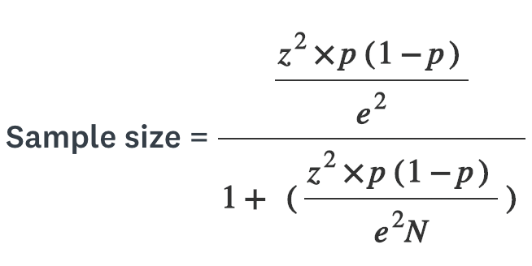

<p align="center">
  
  <h1 align="center">Sample Size</h1>
</p>

Package to determine the correct sample size for a survey

### What is Sample Size?

Every survey needs an ideal number of responses according to the survey's target audience. This is where a statistical calculation that determines the desired sample size comes in.

The calculation is based on three important variables: population size, confiability rate and margin of error.

<p align="center">
  
</p>

* **N**: The population size
* **z**: Score calculated from the confiability rate
* **e**: Margin of error
* **p**: Constant, generally 0.5

More information [here](https://www.surveymonkey.com/mp/sample-size-calculator/).

### Getting started

Install the package:

```bash
npm install @gabrielrufino/samplesize
```

Calculate the sample size:

```js
import SampleSize from '@gabrielrufino/samplesize'

const size = SampleSize.calculate({
  population: 3000,
  confidence: SampleSize.confidences['90%'],
  errorMargin: 0.05,
})

console.log(size) // 250
```

### License

UNLICENSED
